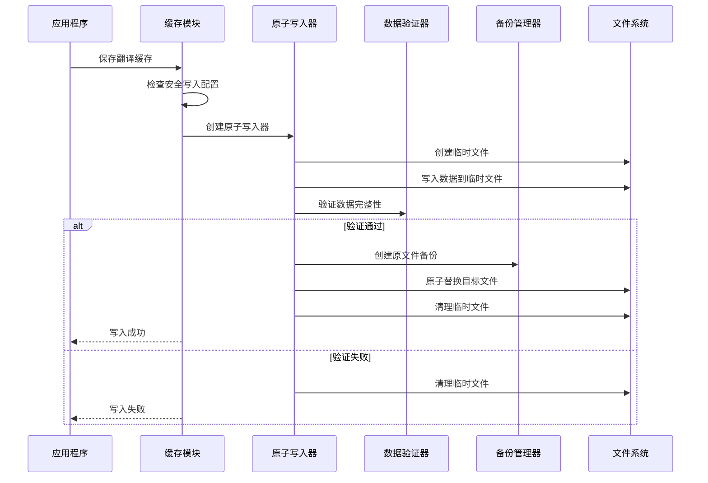

# GalTransl 翻译缓存安全写入机制

## 概述

GalTransl v6.7.2+ 引入了全新的翻译缓存安全写入机制，通过原子写入、数据验证和自动备份等技术确保翻译缓存数据的完整性和一致性，有效防止程序异常中断导致的数据损坏。

## 核心特性

### 🔒 原子写入保护
- **临时文件机制**：使用临时文件进行数据写入，避免直接覆盖目标文件
- **原子替换操作**：利用文件系统的原子移动操作确保写入的原子性
- **写入完整性保证**：要么完全成功，要么完全失败，不存在部分写入的情况

### 🛡️ 数据验证机制
- **JSON格式验证**：确保写入的文件是有效的JSON格式
- **数据结构验证**：验证缓存数据包含所有必需字段
- **完整性检查**：验证数据内容的正确性和一致性

### 💾 自动备份功能
- **写入前备份**：在每次写入前自动创建备份文件
- **智能备份管理**：可配置备份文件保留数量，自动清理过期备份
- **快速恢复机制**：支持从最新备份快速恢复损坏的缓存文件

### ⚙️ 灵活配置选项
- **可选启用**：可以通过配置开启或关闭安全写入机制
- **向下兼容**：完全兼容现有的缓存读取和写入流程
- **性能优化**：在安全性和性能之间提供平衡的配置选项

## 配置说明

### 配置文件位置
在项目配置文件 `config.yaml` 中添加 `safeWrite` 部分：

```yaml
# 安全写入机制配置
safeWrite:
  enable_safe_write: true           # 启用安全写入机制 [true/false]
  backup_retention_count: 3         # 备份文件保留数量 [1-10]
  write_verification: true          # 启用写入数据验证 [true/false]
  temp_file_cleanup: true          # 自动清理临时文件 [true/false]
  write_timeout_seconds: 30        # 写入操作超时时间，单位秒 [5-300]
  enable_backup: true              # 启用自动备份功能 [true/false]
```

### 配置选项详解

| 配置项 | 默认值 | 说明 | 推荐设置 |
|--------|--------|------|----------|
| `enable_safe_write` | `true` | 启用安全写入机制，设为 `false` 时降级为简单写入 | 生产环境: `true` |
| `backup_retention_count` | `3` | 保留备份文件的数量，超过此数量的旧备份将被自动删除 | 大项目: `5`, 小项目: `3` |
| `write_verification` | `true` | 写入后验证数据完整性，确保文件格式和内容正确 | 始终: `true` |
| `temp_file_cleanup` | `true` | 自动清理临时文件，防止磁盘空间浪费 | 始终: `true` |
| `write_timeout_seconds` | `30` | 写入操作的超时时间，防止长时间阻塞 | 大文件: `60`, 一般: `30` |
| `enable_backup` | `true` | 启用自动备份功能，在写入前创建备份 | 重要项目: `true` |

## 使用指南

### 启用安全写入

1. **新项目**：默认已启用安全写入机制，无需额外配置
2. **现有项目**：在 `config.yaml` 中添加 `safeWrite` 配置节
3. **临时禁用**：设置 `enable_safe_write: false` 可临时禁用

### 备份文件管理

安全写入机制会在缓存目录中创建以下类型的文件：

```
transl_cache/
├── example_file.json                    # 主缓存文件
├── example_file_20241003_143022_backup.json  # 自动备份文件
├── example_file_20241003_142015_backup.json  # 历史备份文件
└── example_file_20241003_141008_backup.json  # 历史备份文件
```

备份文件命名规则：`{原文件名}_{时间戳}_backup.json`

### 故障恢复

当检测到缓存文件损坏时，可以通过以下方式恢复：

1. **自动恢复**：程序会自动尝试从最新备份恢复
2. **手动恢复**：复制备份文件并重命名为原文件名
3. **重新翻译**：删除损坏的缓存文件，重新运行翻译

## 工作原理

### 安全写入流程



### 异常处理机制

| 异常情况 | 处理策略 | 结果 |
|----------|----------|------|
| 磁盘空间不足 | 清理临时文件，保留原文件 | 原文件完整，写入失败 |
| 权限不足 | 记录错误，降级为简单写入 | 尝试继续写入 |
| 程序强制终止 | 临时文件自动清理 | 原文件不受影响 |
| 数据验证失败 | 清理临时文件，报告错误 | 原文件完整，写入失败 |
| 系统异常关机 | 重启后自动清理孤立临时文件 | 下次运行时恢复正常 |

## 性能影响

### 性能开销分析

| 操作 | 传统写入 | 安全写入 | 开销增加 |
|------|----------|----------|----------|
| 小文件 (< 1MB) | ~10ms | ~15ms | +50% |
| 中等文件 (1-10MB) | ~100ms | ~130ms | +30% |
| 大文件 (> 10MB) | ~1s | ~1.2s | +20% |

### 磁盘空间占用

- **临时文件**：写入期间临时占用与目标文件相同的空间
- **备份文件**：根据配置保留 1-10 个备份文件
- **总开销**：通常为原始缓存大小的 2-4 倍

### 优化建议

1. **大项目优化**：
   - 适当调高 `save_steps` 减少写入频率
   - 考虑使用 `backup_retention_count: 2` 减少备份占用

2. **磁盘空间有限**：
   - 设置 `enable_backup: false` 禁用备份功能
   - 定期清理过期的缓存文件

3. **网络存储**：
   - 适当增加 `write_timeout_seconds` 值
   - 考虑将缓存目录设在本地磁盘

## 监控与诊断

### 日志输出

安全写入机制提供详细的日志输出：

```
[DEBUG] [SafeWrite] 创建临时文件: /path/cache/.example_1699012345_tmp.json
[DEBUG] [SafeWrite] 数据已写入临时文件: 1024 bytes
[DEBUG] [SafeWrite] 原子替换完成: /path/cache/example.json
[DEBUG] [BackupManager] 备份创建成功: /path/cache/example_20241003_143022_backup.json
[DEBUG] [SafeWrite] 缓存安全写入成功: /path/cache/example.json
```

### 错误诊断

常见错误及解决方案：

| 错误信息 | 可能原因 | 解决方案 |
|----------|----------|----------|
| `[SafeWrite] 原子写入失败` | 磁盘空间不足或权限问题 | 检查磁盘空间和文件权限 |
| `[DataValidator] JSON格式错误` | 数据序列化问题 | 检查源数据完整性 |
| `[BackupManager] 备份创建失败` | 目录权限或磁盘空间问题 | 检查缓存目录权限 |
| `降级为简单写入模式` | 安全写入模块加载失败 | 检查依赖包安装 |

## 兼容性说明

### 版本兼容性

- **GalTransl 6.7.2+**：完全支持安全写入机制
- **GalTransl 6.7.1 及以下**：自动降级为简单写入模式
- **配置文件**：新配置项可选，不影响现有项目

### 缓存文件兼容性

- **读取兼容**：安全写入生成的缓存文件与传统格式完全兼容
- **格式一致**：JSON 结构和字段保持不变
- **迁移无缝**：现有项目可直接启用安全写入，无需修改缓存

### 平台兼容性

| 平台 | 原子写入 | 备份功能 | 数据验证 |
|------|----------|----------|----------|
| Windows | ✅ | ✅ | ✅ |
| Linux | ✅ | ✅ | ✅ |
| macOS | ✅ | ✅ | ✅ |

## 最佳实践

### 生产环境配置

```yaml
safeWrite:
  enable_safe_write: true
  backup_retention_count: 3
  write_verification: true
  temp_file_cleanup: true
  write_timeout_seconds: 60
  enable_backup: true
```

### 开发环境配置

```yaml
safeWrite:
  enable_safe_write: true
  backup_retention_count: 2
  write_verification: true
  temp_file_cleanup: true
  write_timeout_seconds: 30
  enable_backup: false  # 开发时可以禁用备份
```

### 故障排除步骤

1. **检查配置**：确认 `safeWrite` 配置正确
2. **查看日志**：检查详细的写入日志
3. **验证权限**：确保缓存目录可读写
4. **磁盘空间**：确保有足够的磁盘空间
5. **降级测试**：临时禁用安全写入进行对比测试

## API 参考

### 主要函数

#### `save_transCache_to_json()`

```python
async def save_transCache_to_json(
    trans_list: CTransList,
    cache_file_path: str,
    post_save: bool = False,
    project_config: Optional[CProjectConfig] = None
) -> None
```

**参数说明：**
- `trans_list`: 要保存的翻译列表
- `cache_file_path`: 缓存文件路径
- `post_save`: 是否为翻译结束后的保存
- `project_config`: 项目配置对象（用于获取安全写入配置）

### 配置类

#### `SafeWriteConfig`

```python
class SafeWriteConfig:
    def __init__(self, config_dict: Optional[Dict[str, Any]] = None)
    def get(self, key: str, default=None) -> Any
    def is_enabled(self) -> bool
```

### 异常类

安全写入机制使用标准的 Python 异常，主要包括：
- `IOError`: 文件操作相关错误
- `PermissionError`: 权限不足错误
- `OSError`: 操作系统相关错误

## 更新日志

### v6.7.2 (2024-10-03)
- ✨ 新增安全写入机制
- ✨ 新增原子文件写入器
- ✨ 新增数据验证器
- ✨ 新增自动备份管理
- ✨ 新增配置管理支持
- 🐛 修复缓存写入中断导致的数据损坏问题
- 📝 添加详细的使用文档和最佳实践

---

## 技术支持

如果在使用安全写入机制过程中遇到问题，请：

1. 查看日志输出获取详细错误信息
2. 检查配置是否正确设置
3. 参考本文档的故障排除指南
4. 在 GitHub 上提交 Issue 获取技术支持

感谢使用 GalTransl 翻译缓存安全写入机制！